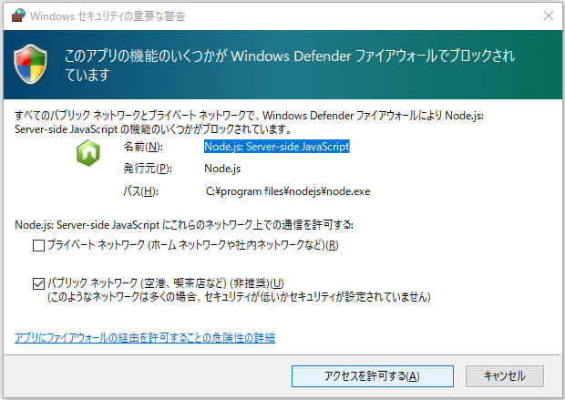
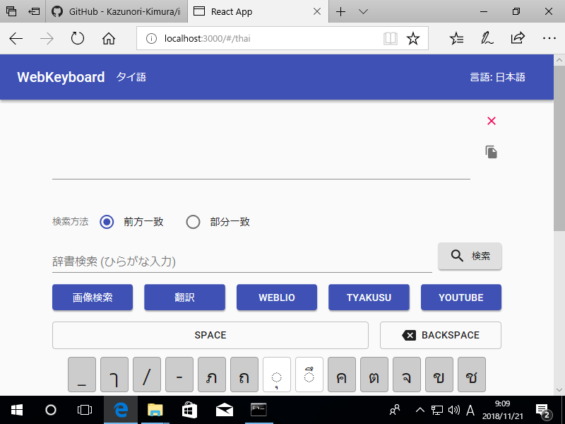

# ビルド方法

ソースコードをWebサーバーで公開可能な形に変換することを**ビルド**といいます。

Windowsを例に解説しますが、他のOSにおいても同様になります。


## コマンドプロンプトの起動とフォルダ移動

スタートメニューから**コマンドプロンプト**を起動します。  
(見つからない場合、スタートメニューで`cmd`と検索すると表示されます。)


ソースコードがあるフォルダに移動します。

```sh
> cd C:¥project¥input-clue¥react-keyboard
```

!!! Note
    ここではダウンロードしたソースコードを `C:¥project¥input-clue` に展開した前提で進めていきます。実際にダウンロードしたパスに読み替えてください。

## ライブラリのインストール

ビルドに必要となるライブラリをダウンロード・インストールします。

```
> npm install
```

ダウンロードにはしばらく時間がかかります。

## 動作確認

次のコマンドを実行するとブラウザが起動し、WebKeyboardが表示されます。

```
> npm start
```

!!! Warning
    辞書ファイルのサイズが大きい、多くの言語の辞書ファイルがある、といった場合はブラウザが起動するまでに時間がかかります。


初回起動時に以下のようなファイアウォールの設定が表示されることがあります。



`アクセスを許可する`　をクリックして続行してください。

きちんと画面が表示されれば、適切にライブラリがインストールされています。



動作確認が終わったらブラウザを終了し、コマンドプロンプトで ++control+c++ を押してください。プログラムが終了します。


## 公開URLの設定

WebKeyboardを公開するURLを設定します。

`C:¥project¥input-clue¥react-keyboard¥package.json` をテキストエディタで開きます。

!!! Tips
    テキストエディタはUTF-8のファイルが扱えるものであれば何でも構いませんが、Windows標準のメモ帳は機能が貧弱なので
    [Visual Studio Code](https://code.visualstudio.com/)、[サクラエディタ](https://sakura-editor.github.io/) あたりがオススメです。


96行目に `homepage` という項目がありますので、ここのURLを管理しているWebサーバーのURLに書き換えてください。

```json
  "homepage": "https://kazunori-kimura.github.io/input-clue",
```

## ビルド

コマンドプロンプトで次のコマンドを実行するとビルドが開始されます。

```
> npm run build
```

`C:¥project¥input-clue¥react-keyboard¥build` というフォルダが生成され、そこにビルドされたファイルが出力されます。
この内容をすべてWebサーバーにアップロードしてください。

