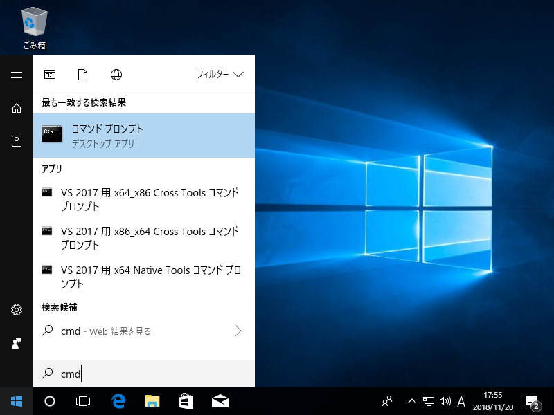

# 辞書検索機能の追加

辞書ファイルを登録することで、WebKeyboardに辞書検索機能を追加することができます。

## 辞書ファイルの作成

以下の4列からなるExcelファイル (`.xlsx`) を用意してください。

| 列 | 内容 | 説明 | 例 |
| --- | --- | --- | --- |
| 1 | ひらがな | 辞書検索時はこの項目に一致するかどうかを判定します | いぬ |
| 2 | 翻訳 | 翻訳されたワード。検索結果から項目をクリックすると、この項目の値がテキストエリアに表示されます | ด็อก |
| 3 | 意味 | ワードの和訳。検索結果に表示されます | 【動物】犬 |
| 4 | 発音記号 | ワードの発音記号。 | dɔ́k |


!!! warning
    - 5列目以降のセルに値があっても無視されます。
    - ヘッダー行は不要です。1行目から辞書データとして扱われます。
    - 空行が間に入らないようにしてください。空行が辞書データの終わりと認識され、以降のデータが登録されない場合があります。
    - セルを結合しないでください。

ファイル名は半角英数字とし、どの言語の辞書ファイルか分かるように（ファイル名が重複しないように）してください。

## 辞書ファイルの登録

ExcelファイルのままではiPhoneなどの一部プラットフォームで処理できないため、辞書ファイルをWebKeyboardで処理しやすい形式に変換します。

!!! Note
    ここではダウンロードしたソースコードを `C:¥project¥input-clue` に展開した前提で進めていきます。実際にダウンロードしたパスに読み替えてください。

### 1. 辞書ファイルの配置

`C:¥project¥input-clue¥react-keyboard¥dictionary` フォルダに辞書ファイルを配置してください。


### 2. 辞書ファイル名の登録

`C:¥project¥input-clue¥react-keyboard¥src¥commons¥index.js` に辞書ファイル名を記載します。

```js
/**
 * キーボードの言語定義
 */
export const languages = {
  // タイ語
  thai: {
    dictionary: 'PdicThai-JP-092U.xlsx', // ← 辞書ファイル名を記載
    keycode: 'thai.json',
  },
  // 韓国語
  korean: {
    keycode: 'korean.json',
  },
  // タイ語&発音記号
  thai_pho: {
```

### 3. コマンドプロンプトの起動とフォルダ移動

スタートメニューから**コマンドプロンプト**を起動します。  
(見つからない場合、スタートメニューで`cmd`と検索すると表示されます。)




ソースコードがあるフォルダに移動します。

```sh
> cd C:¥project¥input-clue¥react-keyboard
```

### 4. 変換処理

コマンドプロンプトで次のコマンドを実行すると変換処理が開始されます。

```
> npm run convert
```

`C:¥project¥input-clue¥react-keyboard¥public¥dictionary` に辞書ファイル名と同名のフォルダが作成され、その中に `data.json` というファイルが生成されます。

### 5. 動作確認

次のコマンドを実行するとブラウザが起動し、WebKeyboardが表示されます。

```
> npm start
```

左上のコンボボックスから辞書登録した言語を選択し、辞書検索が表示されるか確認します。

(初回読み込み時はデータ登録処理に少し時間がかかります。)

動作確認が終わったらブラウザを終了し、コマンドプロンプトで ++control+c++ を押してください。プログラムが終了します。

### 6. ビルド

辞書ファイルを更新・追加した際はビルド処理が必要です。

コマンドプロンプトで次のコマンドを実行します。

```
> npm run build
```

`C:¥project¥input-clue¥react-keyboard¥build` というフォルダにビルドされたファイルが出力されます。
この内容をすべてWebサーバーにアップロードしてください。
