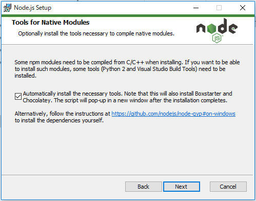
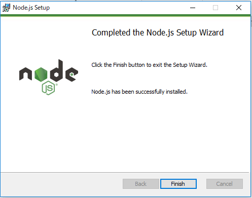
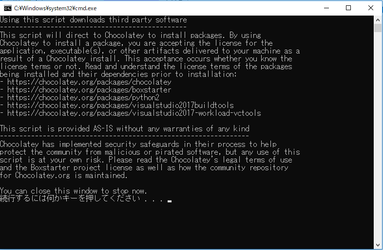
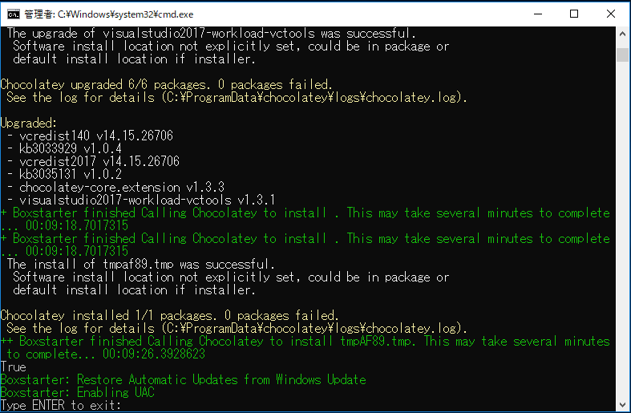

# Node.jsのインストール

WebKeyboardを公開可能な形に変換する（**ビルド**といいます）ために必要となる :fa-external-link: [Node.js](https://nodejs.org/ja/) をインストールします。

## Node.jsがインストールされているか確認する

Node.jsがお使いのPCにセットアップされていない場合は :fa-external-link: [Node.js](https://nodejs.org/ja/) のサイトから最新のLTS (Long Term Support) 版をダウンロード・インストールしてください。

すでにインストール済みかどうかはコマンドラインで以下のように確認することができます:

```sh
$ node -v
v10.13.0
$ npm -v
6.4.1
```

## Node.jsのインストール手順 (Windows)

!!! warning
    インストール途中でPCの再起動が行われますので、作業中のファイルなどがあれば閉じておいてください。

[Node.js](https://nodejs.org/ja/) のサイトから最新のLTS (Long Term Support) 版をダウンロードします。

MSI形式のインストーラーとなっていますので、ダブルクリックしてインストールを行います。

セットアップ ウィザードに沿って進めていくと、以下のような項目があります。



> いくつかのnpmモジュールは、インストール時にC / C ++からコンパイルする必要があります。このようなモジュールをインストールしたいのであれば、いくつかのツール（Python 2とVisual Studio Build Tools）をインストールする必要があります。
> 
> [ ] 必要なツールを自動的にインストールします。これはBoxstarterとChocolateyもインストールすることに注意してください。インストールが完了した後、スクリプトは新しいウィンドウにポップアップ表示されます。

**Automatically install...** にチェックを入れて進めてください。



Node.jsのインストールウィザードで `Finish` をクリックすると、続いてPython 2とVisual Studio Build Toolsをインストールするスクリプトが実行されます。

何度か **続行するには何かキーを押してください...** と表示されますので、++enter++を押して続行します。



途中、PC再起動がかかります。



**Type ENTER to exit** と表示されたらセットアップ完了です。

++enter++を押して終了します。
