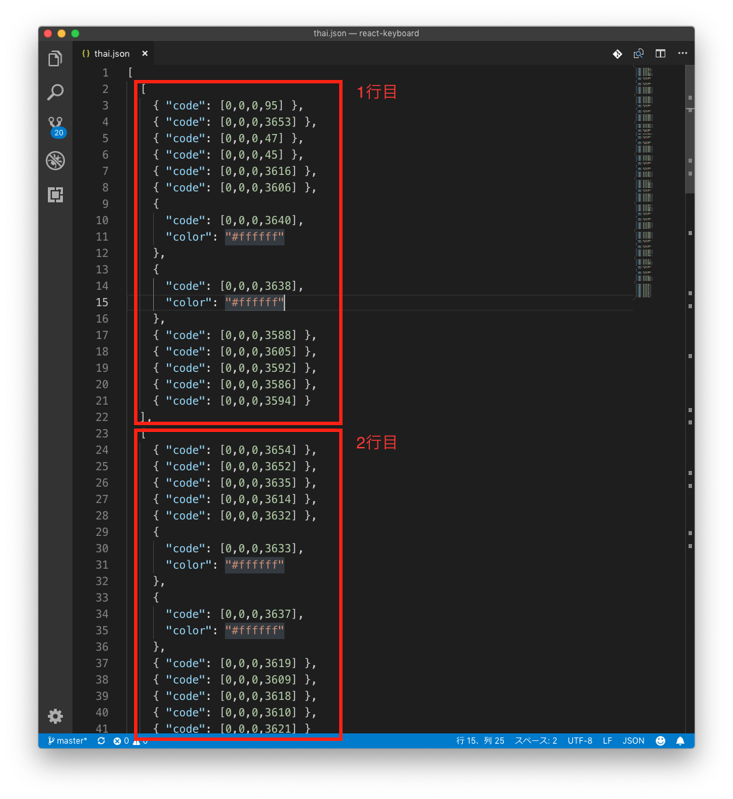

# 対応言語の追加方法

WebKeyboardのキーボード定義を作成することで、対応言語を追加することが可能です。

キーボードの1ボタンがひとつの文字に該当するような言語であればここに記載の手順で追加できます。

文字入力に特殊な法則性があるような言語についてはここに記載の手順で追加することはできません。

!!! Failure "追加できない言語の例"
    日本語のローマ字入力や韓国語の初声・中声・終声のような、複数のキーからひとつの文字が構成される場合

## キーボード定義について

`input-clue¥react-keyboard¥public¥keycode` にキーボード配列を定義したファイルが格納されています。このファイルを更新することでキーボードの表示を修正することができます。

ファイル名は半角英数字であれば特に規定はありませんが、言語名を指定するのが分かりやすくて良いと思います。

## キーボード定義の追加

以下の手順でキーボード定義を追加することができます。

**タガログ語**を追加する手順を例にして解説します。

### 1. キーボード定義ファイルの追加

`input-clue¥react-keyboard¥public¥keycode` にキーボード配列を定義したファイルを追加します。
ファイル名は分かりやすいように `tagalog.json` とします。

ファイルは2次元配列になっています。


ふたつめの `[` から `]` の間が1行になります。
`{` `}` がキーの定義です。 `code` に配列で文字コードを**10進数で**定義します。

文字コードの値については [Unicode Consortium](https://www.unicode.org/) の表 ([Code Charts](https://www.unicode.org/charts/)) を確認ください。

タガログ語は [こちら](https://www.unicode.org/charts/PDF/U1700.pdf) です。

`color` を定義することでボタンの背景色を指定できます。`#000000` から `#ffffff` の間の任意のカラーコードを指定できます。


### 2. 追加フォントの配置

該当言語の表示に追加のフォントが必要な場合、 `input-clue¥react-keyboard¥src¥font` フォルダに配置します。

`input-clue¥react-keyboard¥src¥index.css` を修正し、追加フォントを読み込むよう指定します。
5行目〜7行目の `src` を修正します。

例えば `new-font.ttf` というファイルを追加する場合、以下のように指定してください。

```css
@font-face {
  font-family: -apple-system, BlinkMacSystemFont, "Segoe UI", "Roboto", "Oxygen",
  "Ubuntu", "Cantarell", "Fira Sans", "Droid Sans", "Helvetica Neue",
  sans-serif;
  src: url('./font/estre.ttf') format('truetype'),
    url('./font/DejaVuSans.ttf') format('truetype'),
    url('./font/DejaVuSans.eot'), /* 末尾の ; を , に修正 */
    url('./font/new-font.ttf'); /* <- この行を追加 */
}
```


### 3. WebKeyboardにキーボード定義を登録する

`input-clue¥react-keyboard¥src¥commons¥index.js` にキーボード定義を登録します。
7行目からの**キーボードの言語定義**に項目を追加します。

今回は末尾に追加します。

!!! tips
    WebKeyboardのコンボボックスには`languages`に定義した順番で表示されます

```js
/**
 * キーボードの言語定義
 */
export const languages = {
  // タイ語
  thai: {
    dictionary: 'PdicThai-JP-092U.xlsx', // 辞書ファイル
    keycode: 'thai.json', // 文字コード定義ファイル
  },
  /* ~~~ 途中省略 ~~~~ */
  // フランス語＆IPA
  french_pho: {
    keycode: 'french_pho.json',
  },
  // vvv ここから追加 vvv
  // タガログ語
  tagalog: {
    keycode: 'tagalog.json',
  },
  // ^^^ ここまで追加 ^^^
};
```

フォント指定がある場合は合わせて `fontFamily` を指定してください。
また、右から左に書く言語の場合はここで `direction: 'rtl'` (rtl: right to left) を指定します。


### 4. 翻訳ファイルの更新

`input-clue¥react-keyboard¥src¥commons¥locales` の翻訳ファイルを更新し、タガログ語を追加します。

`ja.json` を以下のように更新します。

```json
{
  "app_name": "WebKeyboard",
  "languages": {
    "tagalog": "タガログ語",
    "thai": "タイ語",
    "korean": "韓国語",
```

`locales` フォルダにある各言語の翻訳ファイルについて、同じようにタガログ語を追加します。

### 5. 動作確認

次のコマンドを実行するとブラウザが起動し、WebKeyboardが表示されます。

```
> npm start
```

左上のコンボボックスから追加した**タガログ語**を選択し、意図した通りに表示されているか確認します。

動作確認が終わったらブラウザを終了し、コマンドプロンプトで ++control+c++ を押してください。プログラムが終了します。


### 6. ビルド & アップロード

以下のコマンドでビルドを行い、変更内容を反映します。

```
> npm run build
```

生成された `build` フォルダをWebサーバーにアップロードしてください。


